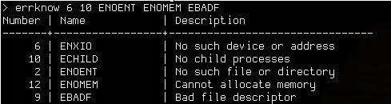

# errknow

A small utility for describing errno error codes and error names.

`usage: errknow [error code|error name]`

Running `errknow` without any arguments will cause it to give information on every error.

`errknow` can detect spelling errors and provide suggestions.

Note: `errno` value 0 has no name, which is why none is displayed.
I think of it as `EOK` or `ESUCCESS`, but have neglected to use these to avoid confusion.

## Building

Note: `-Werror` can be disabled by setting `NOWERROR=1`

To build `errknow`, run `make`.
To configure build flags, modify the `CFLAGS` and `LDFLAGS` environment variables.  

By default, `errknow` is installed under `/usr/local/bin`
but this can be changed by setting the `PREFIX` environment variable
to your preferred path.
